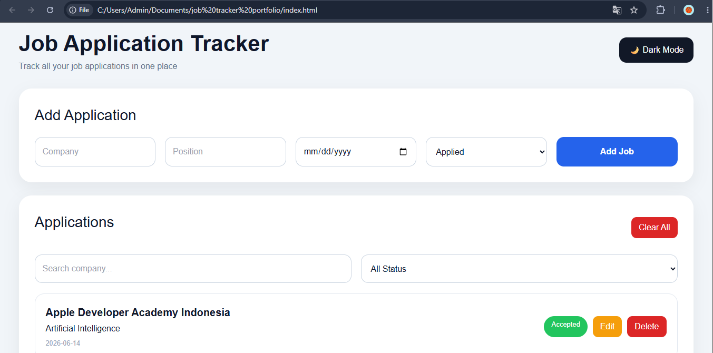
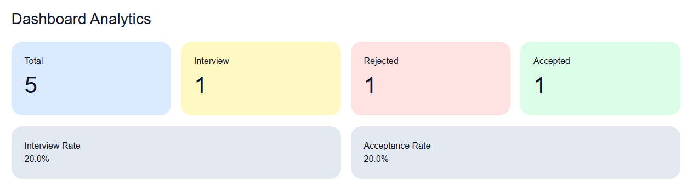

<div align="center">

# 💼 Job Application Tracker

### Track • Analyze • Improve Your Job Hunting Journey

A modern job application management dashboard built with Vanilla JavaScript, Local Storage, and Chart.js.

Designed to help job seekers organize applications, monitor recruitment progress, and visualize career opportunities through an intuitive analytics dashboard.


</div>

---

# 📌 Overview

Job Application Tracker is a lightweight productivity application that enables users to manage job applications efficiently.

The application allows users to:

✅ Track job applications

✅ Monitor recruitment status

✅ Analyze interview and acceptance rates

✅ Visualize application statistics

✅ Store data locally without requiring a backend

This project demonstrates front-end development fundamentals including:

- DOM Manipulation
- CRUD Operations
- Local Storage Management
- Data Visualization
- Responsive UI Design
- Theme Switching (Dark Mode)

---


# 🖼️ Screenshots

## Dashboard





---

# ✨ Key Features

## Job Application Management

- Add new applications
- Edit application status
- Delete applications
- Clear all records

## Search & Filtering

- Search by company name
- Filter by application status

## Analytics Dashboard

- Total applications
- Interview count
- Accepted count
- Rejected count
- Interview rate
- Acceptance rate

## Interactive Charts

- Doughnut chart visualization
- Real-time updates

## Dark Mode

- One-click theme switching
- Theme persistence using Local Storage

## Offline Data Persistence

- Stores data locally
- No database required

---

# 🏗️ System Architecture

```text
User
 │
 ▼
HTML Interface
 │
 ▼
JavaScript Logic
 │
 ├── CRUD Operations
 ├── Search & Filter
 ├── Dashboard Analytics
 ├── Theme Manager
 └── Chart.js Visualization
 │
 ▼
Local Storage
```

---

# 📂 Project Structure

```text
job-application-tracker
│
├── index.html
├── style.css
├── script.js
├── README.md
│
└── screenshots
```

---

### Dynamic Dashboard

Statistics are calculated automatically whenever data changes.

### Chart.js Integration

Real-time visualization of application outcomes through interactive charts.

### Responsive Design

Optimized for:

- Desktop
- Tablet
- Mobile Devices

---

# 🎯 Why I Built This

As students and fresh graduates often submit dozens of applications across multiple companies, it becomes difficult to monitor recruitment progress manually.

This project was built to solve that problem by providing:

- Better organization
- Progress tracking
- Application analytics
- Visual insights

while also serving as a practical front-end development project.

---

# 🚀 Future Enhancements

- Export to PDF
- Export to Excel
- Firebase Integration
- Authentication System
- Company Notes
- Job Deadline Reminder
- Email Notifications
- Drag & Drop Kanban Board
- Multi-user Support
- AI-Based Application Insights

---

# 🧠 Skills Demonstrated

### Front-End Development

- HTML5
- CSS3
- JavaScript ES6

### Data Handling

- Local Storage API
- JSON Manipulation

### UI/UX

- Responsive Design
- Dark Mode
- Dashboard Layout

### Visualization

- Chart.js
- Analytics Dashboard

---

<div align="center">

</div>
